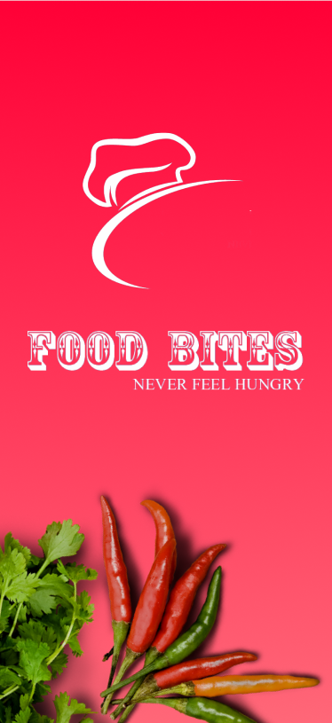
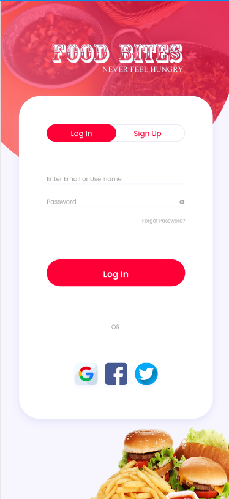
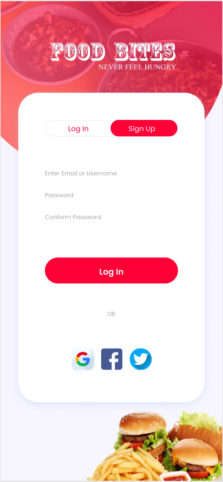
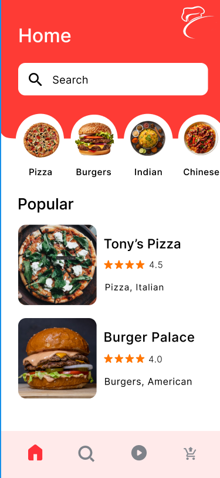
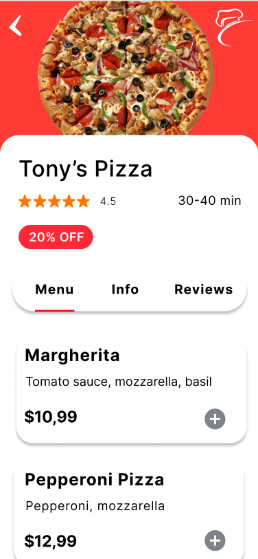
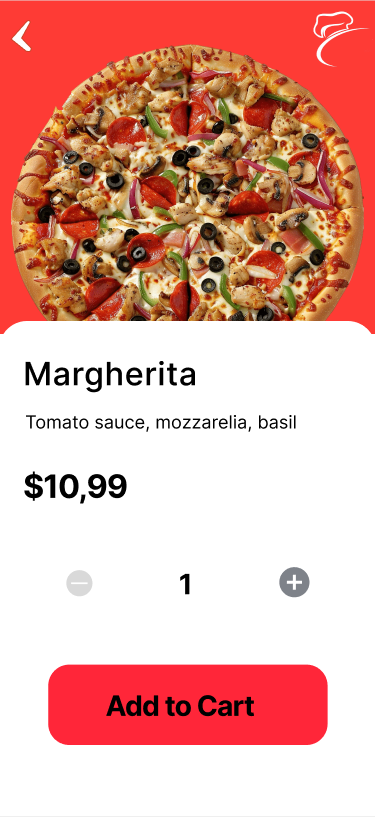
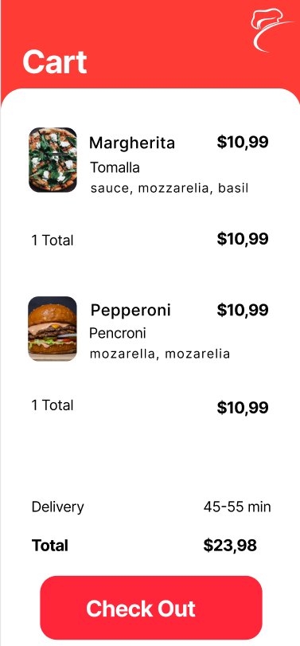

# 🍔 Food Bites – Never Feel Hungry

Welcome to **Food Bites**, a sleek and modern mobile UI design for a food ordering app. Built in **Figma**, this UI focuses on delivering a smooth, visually engaging, and user-friendly experience to browse restaurants, view dishes, and place orders easily.

---

## 📱 App Screens Overview

### 🔻 Splash & Authentication Screens

| Splash Screen | Login Page | Sign Up Page |
|:-------------:|:----------:|:------------:|
|  |  |  |

---

### 🏠 Main App Screens

| Home Page | Restaurant Page | Dish Page | Cart Page | Order Page |
|:---------:|:----------------:|:---------:|:----------:|:-----------:|
|  |  |  |  |  |

---

## 🎯 Features Designed

- 🍽️ Splash screen with strong branding and tagline.
- 🔐 Login and Sign Up pages with social media login options.
- 🏠 Home screen showcasing popular categories and restaurants.
- 🍕 Restaurant and dish detail screens with interactive UI.
- 🛒 Cart management and checkout experience.

---

## 🛠 Tools Used

- 🎨 **Figma** – UI/UX Design Tool
- 🖼️ **PNG** Assets – For presenting high-quality screen previews

---

## 📎 View Prototype

[🔗 View Live Figma Prototype](https://www.figma.com/your-prototype-link) <!-- Replace with actual Figma prototype link -->

---

## 🤝 Let's Connect

If you liked this UI design or are interested in collaboration, feel free to reach out.

> “Good food is all the sweeter when shared with good design.” 🍽️

---

© 2025 Food Bites UI by PARSHANT YADAV
